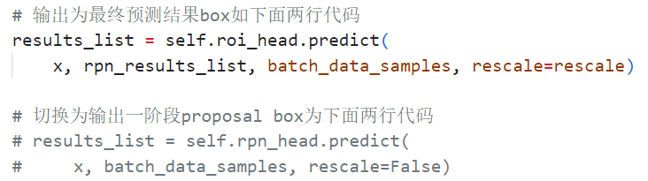

# Object Detection and Instance Segmentation

**Ruihan Wu**  
Fudan University  
Email: [22307140084@m.fudan.edu.cn](mailto:22307140084@m.fudan.edu.cn)

---

## Overview 🗂

This repository aims to implement **object detection** and **instance segmentation** tasks using models from the [MMDetection](https://github.com/open-mmlab/mmdetection) framework, specifically focusing on **Mask R-CNN** and **Sparse R-CNN**. 🛠 The project uses **Pascal VOC 2007** dataset as the benchmark for training and evaluation. 

This repository includes the following files:

- `mask-rcnn_r50_fpn_ms-poly-2x_voc.py`: Configuration file used for the **Mask R-CNN** model.
- `sparse-rcnn_r50_fpn_1x_voc.py`: Configuration file used for the **Sparse R-CNN** model.
- `split.py`: Script for splitting the dataset.
- `visualize_rpn_vs_final.py`: A script for visualizing the proposal boxes (from the RPN) and the final results of the **Mask R-CNN** model.
- `class_names.py`, `coco.py`, `two_stage.py`: Adaptations of MMDetection framework files to work with the Pascal VOC dataset and its specific categories.

- Processed Pascal VOC dataset, training model weights, and visualization results can be downloaded via the following Baidu Cloud link:
  - **Link**: [https://pan.baidu.com/s/1_TR6pxyXcq4oo3VLtJxxTQ](https://pan.baidu.com/s/1_TR6pxyXcq4oo3VLtJxxTQ)
  - **Password**: `txkp`

---

## Implementation ⚙️

### 1. Version Information
- `Python`: 3.9.21
- `MMDetection`: 3.3.0
- `MMCV`: 2.1.0
- `PyTorch`: 2.1.0+cu121
- `CUDA`: 12.9 (local execution)

### 2. Data Processing

To conduct training locally, it is necessary to convert the VOC dataset format to COCO dataset form and reorganize its directory structure.

In this project, we utilized the dataset conversion tool provided by MMDetection (`tools/dataset_converters/pascal_voc.py`) to convert the XML format of VOC2012 into the standard COCO dataset JSON format. Additionally, the script `split_data.py` was used to reorganize the directory and split the dataset into training, validation, and test sets with a ratio of 8:1:1.

After performing format conversion and directory reorganization, the `coco` directory should be placed under `mmdetection/data`. (All subsequent example instructions correspond to this project structure.)

### 3. Modification

- **Modify the `CocoDataset` in `mmdetection/mmdet/datasets/coco.py`:**
   Update the `classes` and `palette` attributes in the `CocoDataset` class, replacing the COCO category names and color palette with those corresponding to the VOC dataset.

- **Modify the function `coco_classes()` in `mmdetection/mmdet/evaluation/functional/class_names.py`:**
   Update the return values of the `coco_classes()` function to reflect the category names of the VOC dataset.

- If we wish to output proposal box from stage 1, we need to modify corresponding parts in `mmdetection\mmdet\models\detectors\two_stage.py` as shown in the picture below:

## Training 🏋️

## Test 🧪
